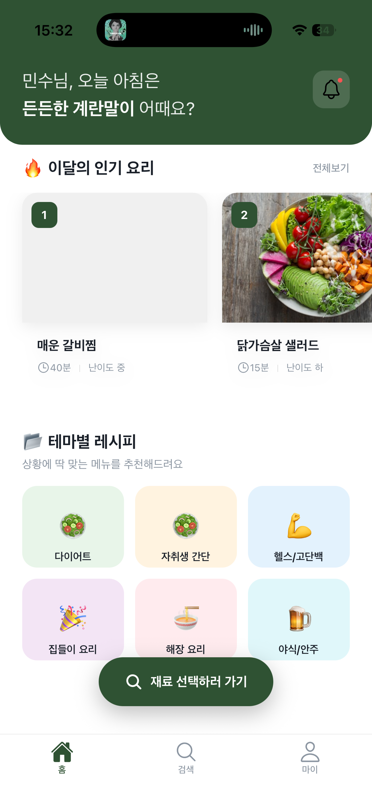

# 👨‍🍳 Picook (피쿡)

> **냉장고 속 재료로 완성하는 오늘의 식탁** > AI 기반 맞춤형 레시피 큐레이션 & 식재료 관리 서비스


## 📖 프로젝트 소개



**Picook**은 "오늘 뭐 먹지?"라는 현대인의 고민을 해결하기 위해 시작된 모바일 애플리케이션입니다.  
사용자가 보유한 냉장고 속 재료를 기반으로 최적의 레시피를 추천하며, 시간대와 상황(다이어트, 해장, 자취 등)에 맞는 맞춤형 큐레이션을 제공합니다.

### 핵심 문제 해결

- **냉장고 파먹기:** 유통기한이 임박한 재료나 남은 재료를 활용할 수 있는 레시피를 제안합니다.
- **결정 장애 해결:** 아침/점심/저녁 시간대에 맞춰 AI가 메뉴를 추천해줍니다.
- **개인화:** 사용자의 식습관과 선호도를 반영한 레시피 랭킹을 제공합니다.

---

## 📱 주요 기능 (MVP)

- **🔐 소셜 로그인:** 카카오, 네이버, 구글 원클릭 로그인 지원
- **🏠 홈 큐레이션:**
  - 시간대별 맞춤 인사 및 메뉴 추천 ("민수님, 오늘 아침은 든든한 계란말이 어때요?")
  - 이달의 인기 레시피 (가로 스크롤 뷰)
  - 테마별 레시피 컬렉션 (다이어트, 자취생 간단 요리 등)
- **🥦 재료 기반 검색:** 보유 중인 재료를 선택하면 만들 수 있는 요리를 매칭 (Hybrid Search)
- **👤 마이페이지:** 프로필 관리 및 로그아웃 기능

---

## 🛠 기술 스택 (Tech Stack)

### Frontend (App)

| 구분           | 스택                        | 설명                                                |
| :------------- | :-------------------------- | :-------------------------------------------------- |
| **Framework**  | React Native (Expo SDK 50+) | 빠르고 효율적인 크로스 플랫폼 개발                  |
| **Language**   | JavaScript (ES6+)           | 유연한 개발 및 생산성 확보                          |
| **State Mngt** | Zustand                     | 가볍고 직관적인 전역 상태 관리 (Boilerplate 최소화) |
| **Navigation** | React Navigation (v6)       | Stack & Bottom Tab 네비게이션 구조                  |
| **Network**    | Axios                       | REST API 통신 및 인터셉터 처리                      |
| **Storage**    | Async Storage               | 자동 로그인 및 로컬 데이터 영속화                   |
| **Styling**    | StyleSheet                  | Native 퍼포먼스를 위한 기본 스타일링                |

### Backend (Server)

- **Framework:** Spring Boot (예정)
- **Database:** PostgreSQL (pgvector 활용 예정)
- **Search:** Hybrid Search (Keyword + Vector)

---

## 🚀 시작하기 (Getting Started)

이 프로젝트를 로컬 환경에서 실행하려면 아래 절차를 따라주세요.

### 1. 사전 요구사항 (Prerequisites)

- Node.js (v18 또는 v20 LTS 권장)
- npm 또는 yarn
- 모바일 기기 (Expo Go 앱 설치) 또는 에뮬레이터

### 2. 설치 (Installation)

저장소를 클론하고 의존성 패키지를 설치합니다.

```bash
# Repository Clone
git clone https://github.com/Mins00oo/Picook_BE

# 폴더 이동
cd Picook

# 패키지 설치
npm install
```

### 3. 환경 변수 설정 (.env)

프로젝트 루트에 .env 파일을 생성하고 아래 내용을 추가하세요.
(현재는 데모 단계이므로 값은 임의로 넣어도 동작합니다.)

```plain text
EXPO_PUBLIC_API_URL=http://localhost:8080 // 로컬 백엔드 API 경로
EXPO_PUBLIC_KAKAO_APP_KEY=your_kakao_key
```

### 4. 실행

```
# 기본 실행
npx expo start
```

## 📂 폴더 구조 (Project Structure)

기능 단위(Feature-based)로 깔끔하게 구조화되어 있습니다.

```
Picook/
├── assets/             # 이미지, 폰트 등 정적 리소스
├── src/
│   ├── components/     # 공통 UI 컴포넌트 (Button, Card 등)
│   ├── screens/        # 화면 단위 컴포넌트 (Login, Home, MyPage)
│   ├── navigation/     # 화면 이동 설정 (Stack, Tab)
│   ├── store/          # Zustand 전역 상태 (Auth, Recipe)
│   ├── services/       # API 통신 로직 (Axios)
│   ├── theme/          # 디자인 토큰 (Colors, Fonts)
│   └── data/           # Mock Data (개발용 더미 데이터)
├── App.js              # 앱 진입점
└── app.json            # Expo 설정 파일
```

## 🤝 기여하기 (Contributing)

이슈(Issues)와 풀 리퀘스트(Pull Requests)는 언제나 환영합니다!

버그를 발견하거나 개선 아이디어가 있다면 편하게 제보해주세요.
